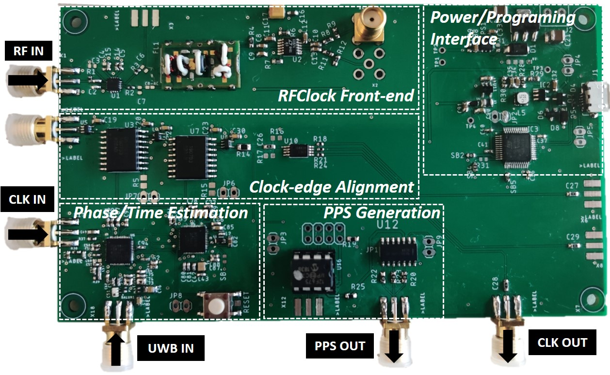

### OVERVIEW

RFClock is highly accurate time, phase and frequency synchronization platform as a stand-alone hardware solution that can be interfaced with distributed COTS SDRs.

### HARDWARE
RFClock schematic is in [Hardware](Hardware/schematic-1.png)

### Implementation
RFClock Implementation detail is in [Implementation](Implementation/RFClock_implementation.txt)